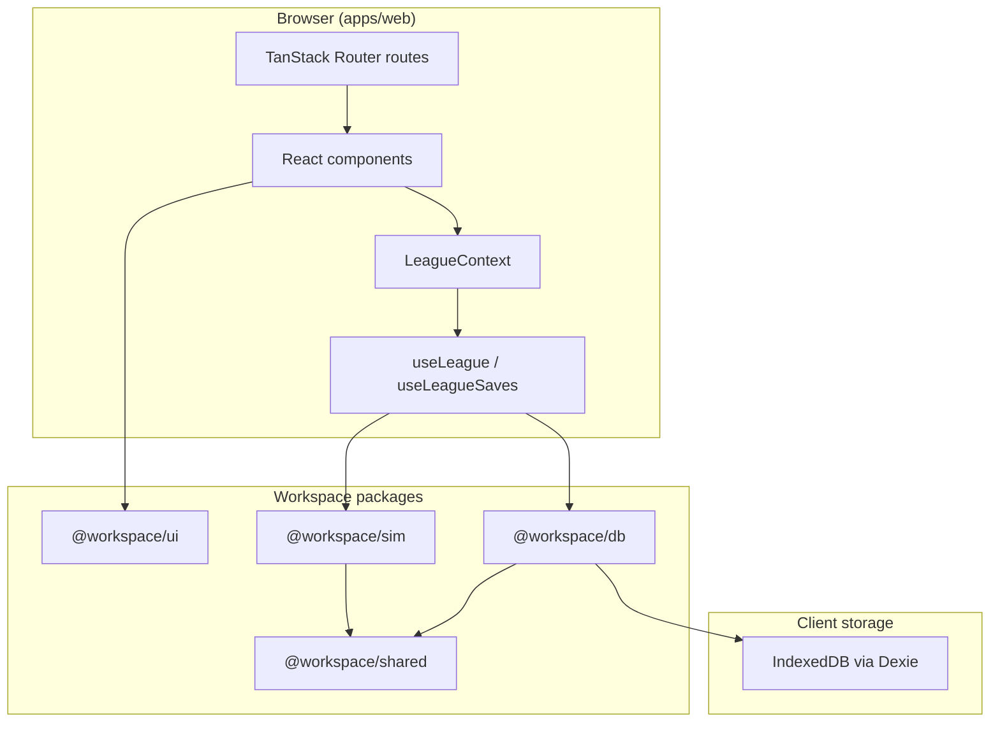

# Architecture

## Overview

Front Office Hoops is a **npm workspaces monorepo** orchestrated by **Turborepo**. The app follows a layered architecture: UI → hooks/context → persistence, with all game logic isolated in a pure simulation package.



## Packages

### `apps/web`

The TanStack Start application. Responsibilities:

- File-based routing (`src/routes/`)
- League UI (standings, schedule, roster, playoffs, box scores)
- React context and hooks that bridge UI ↔ sim ↔ db
- Developer labs (`/sim-lab`, `/season-lab`)

Key dependencies: `@tanstack/react-start`, `@tanstack/react-router`, Tailwind CSS 4, `@workspace/*` packages.

### `packages/sim`

**Pure TypeScript simulation engine.** No React, no DOM, no IndexedDB.

- Game simulation (`simulateTeamMatchup`, `simulateGame`)
- Schedule generation (`createSchedule`)
- Season loop (`simulateDay`, `simulateWeek`, `simulateSeason`)
- Playoffs (`beginPlayoffs`, `simulatePlayoffs`, bracket logic)
- League lifecycle (`createLeague`, `startNextSeason`, `archiveSeason`)
- Procedural generation (`generateTeams`, `generatePlayers`)
- Seeded RNG (`createRng`) for reproducibility

All exports are functions that take immutable-ish state + an `Rng` and return updated state. Vitest tests cover core behavior.

### `packages/shared`

Shared **types and constants** consumed by `sim`, `db`, and `web`.

- Domain types: `Player`, `Team`, `Game`, `SeasonState`, `LeagueRecord`
- League constants: team counts, season lengths, playoff formats
- `SAVE_VERSION` for the current save schema marker

### `packages/db`

**IndexedDB persistence** via Dexie.

- `FOHDatabase` — Dexie schema (`leagues` table indexed by `id`, `updatedAt`, `name`)
- `leagueRepository` — CRUD: `listLeagues`, `getLeague`, `saveLeague`, `deleteLeague`
- Browser-only; throws if `indexedDB` is unavailable (SSR guard)

### `packages/ui`

**shadcn/ui component library** shared across apps. Components live in `src/components/` and are imported as:

```tsx
import { Button } from "@workspace/ui/components/button"
```

Add new components from the repo root:

```bash
pnpm dlx shadcn@latest add <component> -c apps/web
```

## Data flow

### League load

1. `useLeague` mounts → dynamic import `@workspace/db`
2. `listLeagues()` reads IndexedDB, resolves active save from `localStorage`
3. `normalizeLeagueRecord()` normalizes current-shape records
4. State flows into `LeagueProvider` → route components

### Simulation tick

1. User clicks "Simulate day" (or week / playoffs / season)
2. Hook calls `@workspace/sim` function with current `SeasonState` + `Rng`
3. Updated `LeagueRecord` is set in React state
4. Debounced auto-save (300ms) persists to IndexedDB via `saveLeague`

### Active save tracking

`apps/web/src/lib/activeLeague.ts` stores the active league ID in `localStorage` so "Continue league" resumes the right save across sessions.

## Routing

| Route                   | Purpose                                     |
| ----------------------- | ------------------------------------------- |
| `/`                     | Home — continue/create league, manage saves |
| `/league`               | League dashboard                            |
| `/league/create`        | New league wizard                           |
| `/league/pick-team`     | Team selection                              |
| `/league/saves`         | Save slot management                        |
| `/league/standings`     | Standings table                             |
| `/league/schedule`      | Schedule + sim controls                     |
| `/league/stats`         | Player season stats                         |
| `/league/team`          | User team roster                            |
| `/league/playoffs`      | Playoff bracket                             |
| `/league/history`       | Past seasons                                |
| `/league/games/$gameId` | Box score detail                            |
| `/sim-lab`              | Single-game simulation playground           |
| `/season-lab`           | Season simulation playground                |

## Planned layers

### Convex (not yet integrated)

Intended responsibilities:

- User accounts and authentication
- Cloud save sync (optional backup of `LeagueRecord`)
- Realtime features (live league rooms, spectators)
- Server-side AI orchestration (API keys stay off the client)

The sim engine remains client-side; Convex syncs **results and metadata**, not simulation authority.

### Vercel AI SDK (not yet integrated)

Intended for generative content triggered by sim events:

- Post-game recaps and highlight narratives
- Trade rumors and beat reporting
- Press conference Q&A
- Scouting reports and player profiles

AI output will be stored as optional narrative attachments on games/seasons, never overwriting engine stats.

## Design decisions

| Decision                          | Rationale                                                 |
| --------------------------------- | --------------------------------------------------------- |
| Client-side sim                   | Instant feedback, offline play, easy testing              |
| Monorepo                          | Shared types between engine and UI; independent test runs |
| Dexie over raw IndexedDB          | Ergonomic queries, schema versioning                      |
| Seeded RNG                        | Reproducible games given `baseSeed` + context             |
| Dynamic `import("@workspace/db")` | Avoids IndexedDB access during SSR                        |
| `SAVE_VERSION` constant           | Current save schema marker                                |
