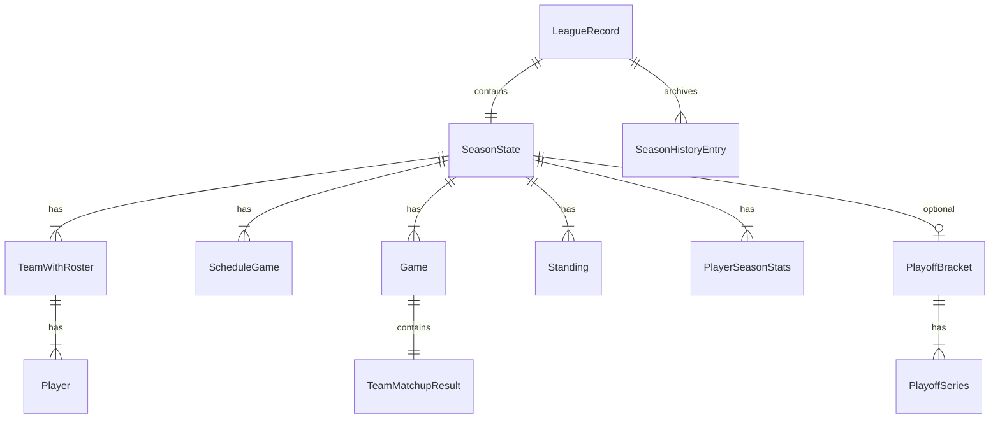

# Data Model

Domain types live in `packages/shared`. Persistence shape mirrors these types directly in IndexedDB.

## Entity relationship



## League

### `League`

Top-level metadata for a save slot.

| Field         | Type             | Description                        |
| ------------- | ---------------- | ---------------------------------- |
| `id`          | `string`         | Unique league ID (`league_<uuid>`) |
| `name`        | `string`         | Display name                       |
| `saveVersion` | `7`              | Current save schema marker         |
| `createdAt`   | ISO string       | Creation timestamp                 |
| `updatedAt`   | ISO string       | Last save timestamp                |
| `userTeamId`  | `string \| null` | Player-controlled team             |

### `LeagueRecord`

Full save payload = `League` + simulation state.

| Field              | Type                   | Description                                             |
| ------------------ | ---------------------- | ------------------------------------------------------- |
| `seasonState`      | `SeasonState`          | Current season                                          |
| `seasonHistory`    | `SeasonHistoryEntry[]` | Completed seasons                                       |
| `contracts`        | `Contract[]`           | League-level player contracts                           |
| `leagueFinancials` | `LeagueFinancials`     | Cap/tax settings by season                              |
| `teamFinancials`   | `TeamFinancials[]`     | Team spending profiles, cash/debt, strategy, exceptions |
| `freeAgentPool`    | `Player[]`             | Unrostered players available in free agency             |

### `LeagueSummary`

Lightweight listing for save slot UI (no full season state).

## Season

### `SeasonState`

| Field               | Type                  | Description                                                |
| ------------------- | --------------------- | ---------------------------------------------------------- |
| `season`            | `number`              | Season year (1-based)                                      |
| `teams`             | `TeamWithRoster[]`    | All teams with rosters                                     |
| `schedule`          | `ScheduleGame[]`      | Full schedule                                              |
| `games`             | `Game[]`              | Completed games                                            |
| `standings`         | `Standing[]`          | Current standings                                          |
| `playerSeasonStats` | `PlayerSeasonStats[]` | Aggregated player stats                                    |
| `currentDay`        | `number`              | Simulation cursor                                          |
| `baseSeed`          | `string`              | League RNG seed                                            |
| `phase`             | `SeasonPhase`         | `regular` \| `playoffs` \| `complete` \| `offseason`       |
| `offseasonPhase`    | `OffseasonPhase?`     | During offseason: `re_signing` \| `draft` \| `free_agency` |
| `playoffBracket`    | `PlayoffBracket?`     | Present during/after playoffs                              |
| `draftState`        | `DraftState?`         | Draft board, order, selections, and remaining prospects    |

### `SeasonHistoryEntry`

Archived season snapshot:

- Champion and runner-up
- Final standings
- User team record and playoff result
- `completedAt` timestamp

### `SeasonPhase`

```
regular → playoffs → complete → offseason
```

Offseason applies player development, expires contracts, then advances through
`re_signing → draft → free_agency` before the next season begins.

## Teams and players

### `Team`

| Field          | Type      | Description           |
| -------------- | --------- | --------------------- |
| `id`           | `string`  | Team identifier       |
| `name`         | `string`  | Full name             |
| `abbrev`       | `string`  | Short code            |
| `overall`      | `number`  | Team overall rating   |
| `pace`         | `number`  | Pace factor           |
| `conferenceId` | `string?` | Conference assignment |
| `divisionId`   | `string?` | Division assignment   |

### `Player`

| Field                       | Type                   | Description                                               |
| --------------------------- | ---------------------- | --------------------------------------------------------- |
| `id`                        | `string`               | Player identifier                                         |
| `teamId`                    | `string \| null`       | Current team; `null` for free agents                      |
| `firstName`, `lastName`     | `string`               | Name                                                      |
| `age`                       | `number`               | Age in years                                              |
| `peakAge`                   | `number`               | Expected peak age for development curve                   |
| `heightInches`, `weightLbs` | `number`               | Physical attributes                                       |
| `position`                  | `PlayerPosition`       | PG, SG, SF, PF, C                                         |
| `archetype`                 | `PlayerArchetype`      | Position-valid role identity used by generation and value |
| `ratings`                   | `PlayerRatings`        | Skill ratings                                             |
| `tags`                      | `PlayerTag[]`          | Modifier tags (e.g. `veteran`)                            |
| `status`                    | `PlayerStatus`         | active, injured, inactive, free_agent                     |
| `injury`                    | `PlayerInjury \| null` | Current injury state and games remaining                  |
| `draftInfo`                 | `DraftInfo \| null`    | Draft origin once selected                                |
| `activeContractId`          | `string \| null`       | Current active contract reference                         |
| `seasonsWithTeam`           | `number`               | Consecutive seasons for Bird rights / re-signing          |
| `yearsOfService`            | `number`               | Contract service tier                                     |

### `PlayerRatings`

`overall`, `potential`, `shooting`, `inside`, `passing`, `rebounding`, `defense`, `stamina`, `usage` — all numeric scales within configured min/max bounds.

### `PlayerArchetype`

Position-valid identity used by generation, usage, sim allocation, and value:

`lead_guard`, `scoring_guard`, `three_and_d_wing`, `slasher`, `point_forward`, `stretch_big`, `rim_protector`, `post_scorer`, `rebounding_big`, `defensive_specialist`, `bench_scorer`, `raw_athlete`.

### `PlayerInjury`

| Field            | Type                             | Description                    |
| ---------------- | -------------------------------- | ------------------------------ |
| `type`           | `minor` \| `moderate` \| `major` | Severity bucket                |
| `gamesRemaining` | `number`                         | Days/games until recovery      |
| `description`    | `string`                         | User-facing injury description |

## Games

### `ScheduleGame`

| Field                      | Type                   | Description               |
| -------------------------- | ---------------------- | ------------------------- |
| `id`                       | `string`               | Schedule entry ID         |
| `season`, `day`            | `number`               | When the game occurs      |
| `homeTeamId`, `awayTeamId` | `string`               | Matchup                   |
| `status`                   | `scheduled` \| `final` | Whether played            |
| `gameId`                   | `string?`              | Link to `Game` when final |
| `seriesId`                 | `string?`              | Playoff series link       |
| `playoffRound`             | `1-4?`                 | Playoff round number      |

### `Game`

Completed game with embedded `TeamMatchupResult`:

- Scores, winner, quarter breakdowns
- Per-player box score stats (`PlayerGameStats`)
- Possession and efficiency metadata (`TeamMatchupMeta`)

### `PlayerGameStats`

Per-game line: minutes, shooting splits, counting stats, starter flag.

### `TeamMatchupMeta`

Stores game-level sim metadata:

- possessions and offensive rating
- rotation quality (`top2`, `starters`, `bench`, `fullRotation`)
- team component stats: FGA/FGM, 3PA/3PM, FTA/FTM, rebounds, assists, steals, blocks, turnovers

## Playoffs

### `PlayoffSeries`

Head-to-head series between seeded teams:

- `higherSeedTeamId` / `lowerSeedTeamId` with seed numbers
- `winsHigher` / `winsLower` — series game wins
- `winnerId` / `loserId` — set when series completes
- `conferenceId` — `east` \| `west` for NBA-style brackets

### `PlayoffBracket`

Collection of series plus `championTeamId` and `runnerUpTeamId`.

## Standings and stats

### `Standing`

Per-team: `wins`, `losses`, `pointsFor`, `pointsAgainst`, `streak`.

### `PlayerSeasonStats`

Season aggregates: `gp`, `gs`, `min`, `pts`, `reb`, `ast`, `stl`, `blk`, `tov`, shooting splits.

## Contracts and financials

Contracts are stored at league level and referenced from players through `activeContractId`.

### `Contract`

Includes player/team IDs, start/end seasons, yearly salary list, contract type (`standard`, `rookie_scale`, `minimum`), signing exception, optional team/player option, status, and signed season.

### Financial state

- `LeagueFinancials` stores base cap assumptions and computed `SeasonFinancials` by season.
- `TeamFinancials` stores market tier, tax tolerance, current strategy mode (`selling`, `buying`, `contending`), cash/debt, MLE state, and trade exceptions for future trade systems.

## Local persistence

### IndexedDB schema (Dexie v1)

Database name: `front-office-hoops`

| Table     | Primary key | Indexes             |
| --------- | ----------- | ------------------- |
| `leagues` | `id`        | `updatedAt`, `name` |

Each row is a full `LeagueRecord` JSON document.

### Active save

`localStorage` key tracks the active league ID (see `apps/web/src/lib/activeLeague.ts`).

### Save versioning

`SAVE_VERSION` (currently `10`) in `packages/shared/src/leagueTypes.ts` marks the current save shape. During pre-user development, older local saves are normalized at load time where possible; clear local saves after schema changes if local prototypes drift.

### Auto-save behavior

`useLeague` debounces saves by 300ms after state changes. Save status: `idle` → `saving` → `saved` \| `error`.

## Future persistence (planned)

| Feature       | Storage                                             |
| ------------- | --------------------------------------------------- |
| Cloud sync    | Convex documents mirroring `LeagueRecord`           |
| AI narratives | Attachments on `Game` or separate `Narrative` table |
| User accounts | Convex auth + ownership mapping to save IDs         |
| Export/import | JSON file download/upload of `LeagueRecord`         |
