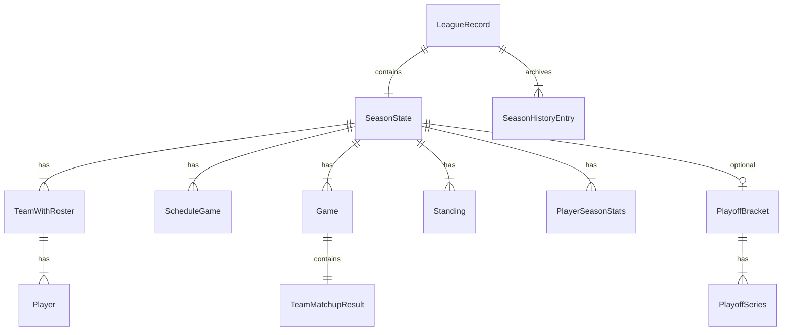

# Data Model

Domain types live in `packages/shared`. Persistence shape mirrors these types directly in IndexedDB.

## Entity relationship



## League

### `League`

Top-level metadata for a save slot.

| Field | Type | Description |
|-------|------|-------------|
| `id` | `string` | Unique league ID (`league_<uuid>`) |
| `name` | `string` | Display name |
| `saveVersion` | `2` | Schema version for migrations |
| `createdAt` | ISO string | Creation timestamp |
| `updatedAt` | ISO string | Last save timestamp |
| `userTeamId` | `string \| null` | Player-controlled team |

### `LeagueRecord`

Full save payload = `League` + simulation state.

| Field | Type | Description |
|-------|------|-------------|
| `seasonState` | `SeasonState` | Current season |
| `seasonHistory` | `SeasonHistoryEntry[]` | Completed seasons |

### `LeagueSummary`

Lightweight listing for save slot UI (no full season state).

## Season

### `SeasonState`

| Field | Type | Description |
|-------|------|-------------|
| `season` | `number` | Season year (1-based) |
| `teams` | `TeamWithRoster[]` | All teams with rosters |
| `schedule` | `ScheduleGame[]` | Full schedule |
| `games` | `Game[]` | Completed games |
| `standings` | `Standing[]` | Current standings |
| `playerSeasonStats` | `PlayerSeasonStats[]` | Aggregated player stats |
| `currentDay` | `number` | Simulation cursor |
| `baseSeed` | `string` | League RNG seed |
| `phase` | `SeasonPhase` | `regular` \| `playoffs` \| `complete` |
| `playoffBracket` | `PlayoffBracket?` | Present during/after playoffs |

### `SeasonHistoryEntry`

Archived season snapshot:

- Champion and runner-up
- Final standings
- User team record and playoff result
- `completedAt` timestamp

### `SeasonPhase`

```
regular → playoffs → complete
```

## Teams and players

### `Team`

| Field | Type | Description |
|-------|------|-------------|
| `id` | `string` | Team identifier |
| `name` | `string` | Full name |
| `abbrev` | `string` | Short code |
| `overall` | `number` | Team overall rating |
| `pace` | `number` | Pace factor |
| `conferenceId` | `string?` | Conference assignment |
| `divisionId` | `string?` | Division assignment |

### `Player`

| Field | Type | Description |
|-------|------|-------------|
| `id` | `string` | Player identifier |
| `teamId` | `string` | Current team |
| `firstName`, `lastName` | `string` | Name |
| `age` | `number` | Age in years |
| `heightInches`, `weightLbs` | `number` | Physical attributes |
| `position` | `PlayerPosition` | PG, SG, SF, PF, C |
| `ratings` | `PlayerRatings` | Skill ratings |
| `status` | `PlayerStatus` | active, injured, inactive |
| `injury` | `null` | Reserved for injury system |
| `draftInfo` | `null` | Reserved for draft system |

### `PlayerRatings`

`overall`, `potential`, `shooting`, `inside`, `passing`, `rebounding`, `defense`, `stamina`, `usage` — all numeric scales within configured min/max bounds.

## Games

### `ScheduleGame`

| Field | Type | Description |
|-------|------|-------------|
| `id` | `string` | Schedule entry ID |
| `season`, `day` | `number` | When the game occurs |
| `homeTeamId`, `awayTeamId` | `string` | Matchup |
| `status` | `scheduled` \| `final` | Whether played |
| `gameId` | `string?` | Link to `Game` when final |
| `seriesId` | `string?` | Playoff series link |
| `playoffRound` | `1-4?` | Playoff round number |

### `Game`

Completed game with embedded `TeamMatchupResult`:

- Scores, winner, quarter breakdowns
- Per-player box score stats (`PlayerGameStats`)
- Possession and efficiency metadata (`TeamMatchupMeta`)

### `PlayerGameStats`

Per-game line: minutes, shooting splits, counting stats, starter flag.

## Playoffs

### `PlayoffSeries`

Head-to-head series between seeded teams:

- `higherSeedTeamId` / `lowerSeedTeamId` with seed numbers
- `winsHigher` / `winsLower` — series game wins
- `winnerId` / `loserId` — set when series completes
- `conferenceId` — `east` \| `west` for NBA-style brackets

### `PlayoffBracket`

Collection of series plus `championTeamId` and `runnerUpTeamId`.

## Standings and stats

### `Standing`

Per-team: `wins`, `losses`, `pointsFor`, `pointsAgainst`, `streak`.

### `PlayerSeasonStats`

Season aggregates: `gp`, `gs`, `min`, `pts`, `reb`, `ast`, `stl`, `blk`, `tov`, shooting splits.

## Local persistence

### IndexedDB schema (Dexie v1)

Database name: `front-office-hoops`

| Table | Primary key | Indexes |
|-------|-------------|---------|
| `leagues` | `id` | `updatedAt`, `name` |

Each row is a full `LeagueRecord` JSON document.

### Active save

`localStorage` key tracks the active league ID (see `apps/web/src/lib/activeLeague.ts`).

### Save versioning

`SAVE_VERSION` (currently `2`) in `packages/shared/src/leagueTypes.ts`. `normalizeLeagueRecord` in `@workspace/sim` upgrades older saves on load.

### Auto-save behavior

`useLeague` debounces saves by 300ms after state changes. Save status: `idle` → `saving` → `saved` \| `error`.

## Future persistence (planned)

| Feature | Storage |
|---------|---------|
| Cloud sync | Convex documents mirroring `LeagueRecord` |
| AI narratives | Attachments on `Game` or separate `Narrative` table |
| User accounts | Convex auth + ownership mapping to save IDs |
| Export/import | JSON file download/upload of `LeagueRecord` |
